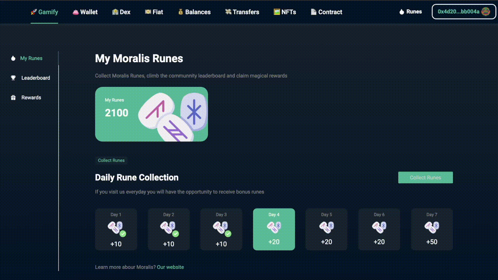

# `Gamification-dApp`

> A clone of CoinMarketCap Diamonds gamification model, built using Moralis and the Ethereum-Boilerplate



🚀Ethereum-Boilerplate: https://ethereum-boilerplate.github.io/ethereum-boilerplate

This boilerplate is built on [react-moralis](https://github.com/MoralisWeb3/react-moralis) and [Moralis](https://moralis.io?utm_source=github&utm_medium=readme&utm_campaign=ethereum-boilerplate). Also has its own context provider for quick access to `chainId` or `ethAddress`


# 🚀 Quick Start

📄 Clone or fork `Gamification-dApp`:
```sh
git clone https://github.com/IAmJaysWay/Gamification-dApp.git
```
💿 Install all dependencies:
```sh
cd Gamification-dApp
yarn install 
```
✏ Rename `.env.example` to `.env` in the main folder and provide your `appId` and `serverUrl` from Moralis ([How to start Moralis Server](https://docs.moralis.io/moralis-server/getting-started/create-a-moralis-server)) 
Example:
```jsx
REACT_APP_MORALIS_APPLICATION_ID = xxxxxxxxxxxx
REACT_APP_MORALIS_SERVER_URL = https://xxxxxx.grandmoralis.com:2053/server
```
🚴‍♂️ Run your App:
```sh
yarn start
```

🧭 Watch a full tutorial of the gamification component being built here: https://youtu.be/hufjWlGDvRA


